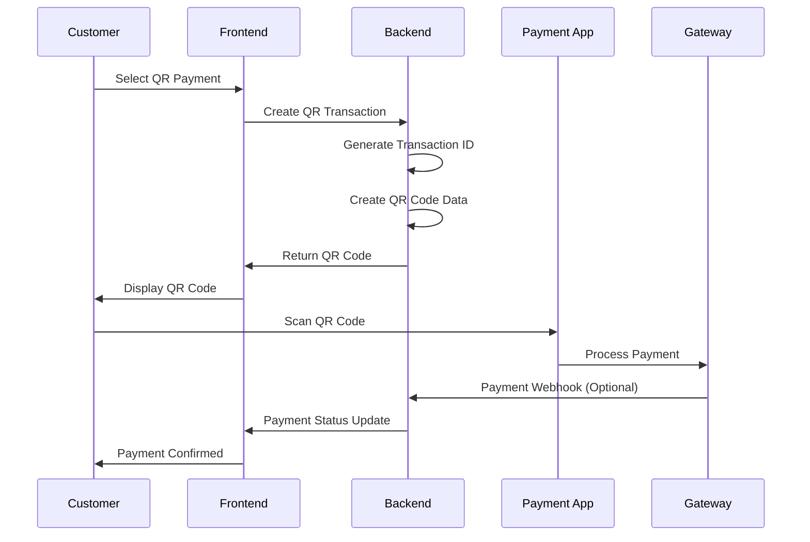

# QR Payment Implementation Guide

This guide explains how to implement and use the QR payment system using QRPH (QR Philippines) standards in your POS system.

## Overview

The QR payment system supports Philippine payment standards including:
- GCash
- PayMaya
- InstaPay
- PESONet
- UnionBank
- BPI
- Other QRPH-compliant payment apps

## Features

### Frontend Features
- **QR Code Generation**: Generates QRPH-compliant QR codes
- **Real-time Payment Monitoring**: Checks payment status every 3 seconds
- **Payment Timeout**: 5-minute timeout for QR code validity
- **Multiple Payment Methods**: Supports various Philippine e-wallets
- **User-friendly Interface**: Clear instructions and status updates
- **Mobile Responsive**: Works on both desktop and mobile devices

### Backend Features
- **QRPH Standard Compliance**: Generates EMV-compliant QR codes
- **Transaction Management**: Tracks payment status and history
- **Webhook Support**: Ready for payment gateway integration
- **Automatic Cleanup**: Expires old pending transactions
- **Comprehensive Logging**: Full audit trail for payments

## Installation

### 1. Install Dependencies

```bash
# Frontend
cd packages/frontend
npm install qrcode

# Backend (no additional dependencies needed)
```

### 2. Database Setup

Run the QR payments schema in your Supabase SQL editor:

```sql
-- Copy and paste the contents of packages/backend/database/schema_qr_payments.sql
```

### 3. Environment Variables

Add these to your `.env` files if needed:

```env
# Optional: Configure merchant details
QR_MERCHANT_ID=MERCHANT001
QR_MERCHANT_NAME=Your Business Name
QR_MERCHANT_CITY=Manila
```

## Usage

### 1. Customer Checkout Process

1. Customer adds items to cart
2. Clicks "Checkout" 
3. Fills in customer information
4. Selects "QR Payment" as payment method
5. Clicks "Generate QR Code"
6. QR code is displayed with payment instructions
7. Customer scans QR code with their mobile banking app
8. Customer completes payment in their app
9. System automatically detects payment completion
10. Receipt is generated and printed

### 2. QR Code Format

The system generates QRPH-compliant QR codes with the following structure:

```
EMV QR Code Format:
- Payload Format Indicator: 01
- Point of Initiation Method: 12 (Dynamic)
- Merchant Account Information: PH.QR.01
- Transaction Currency: 608 (PHP)
- Transaction Amount: [Amount]
- Country Code: PH
- Additional Data: Transaction ID and Description
```

### 3. Payment Flow



## API Endpoints

### Create QR Payment
```http
POST /api/qr-payments/create
Content-Type: application/json

{
  "order_id": "ORDER123",
  "amount": 150.00,
  "currency": "PHP",
  "merchant_id": "MERCHANT001",
  "customer_info": {
    "name": "John Doe",
    "email": "john@example.com",
    "phone": "+639123456789"
  }
}
```

### Check Payment Status
```http
GET /api/qr-payments/status/{transaction_id}
```

### Confirm Payment (Webhook)
```http
POST /api/qr-payments/confirm/{transaction_id}
Content-Type: application/json

{
  "gateway_transaction_id": "GW123456",
  "gateway_reference": "REF789",
  "payment_gateway": "gcash",
  "gateway_response": {...}
}
```

### Cancel Payment
```http
POST /api/qr-payments/cancel/{transaction_id}
Content-Type: application/json

{
  "reason": "Customer cancelled"
}
```

## Configuration

### Merchant Settings

Update the merchant information in the QR code generation:

```javascript
// In packages/backend/routes/qr-payments.js
const qrphData = {
  '26': {
    '00': 'PH.QR.01',
    '01': 'YOUR_MERCHANT_ID',      // Replace with your merchant ID
    '02': 'Your Business Name'      // Replace with your business name
  },
  '59': 'Your Business Name',       // Replace with your business name
  '60': 'Your City',               // Replace with your city
};
```

### Payment Gateway Integration

To integrate with real payment gateways:

1. **GCash Integration**:
   - Register with GCash for Business
   - Get API credentials
   - Implement webhook endpoint
   - Update QR code with GCash-specific data

2. **PayMaya Integration**:
   - Register with PayMaya Business
   - Get API credentials
   - Implement webhook endpoint
   - Update QR code with PayMaya-specific data

3. **InstaPay Integration**:
   - Partner with InstaPay-enabled banks
   - Implement bank-specific APIs
   - Handle multiple bank responses

### Webhook Configuration

Set up webhooks for real-time payment notifications:

```javascript
// Example webhook handler
app.post('/api/qr-payments/webhook/:gateway', (req, res) => {
  const { gateway } = req.params;
  const payload = req.body;
  
  // Verify webhook signature
  if (!verifyWebhookSignature(payload, gateway)) {
    return res.status(401).json({ error: 'Invalid signature' });
  }
  
  // Process payment confirmation
  const { transaction_id, status } = payload;
  
  if (status === 'completed') {
    // Confirm payment in database
    confirmPayment(transaction_id, payload);
  }
  
  res.json({ success: true });
});
```

## Security Considerations

### 1. Transaction Security
- All transactions have 5-minute expiry
- Unique transaction IDs prevent replay attacks
- Status validation prevents double processing

### 2. Webhook Security
- Verify webhook signatures
- Use HTTPS for all communications
- Implement rate limiting

### 3. Data Protection
- Encrypt sensitive customer data
- Log all transactions for audit
- Implement proper access controls

## Testing

### 1. Demo Mode
The system includes a demo mode for testing:
- Manual payment confirmation button
- Simulated payment completion
- No real money transactions

### 2. Test Scenarios
1. **Successful Payment**: Complete full payment flow
2. **Payment Timeout**: Let QR code expire
3. **Payment Cancellation**: Cancel during payment
4. **Network Issues**: Test offline scenarios

### 3. Load Testing
Test the system with multiple concurrent payments:
```bash
# Example load test
for i in {1..10}; do
  curl -X POST http://localhost:3001/api/qr-payments/create \
    -H "Content-Type: application/json" \
    -d '{"order_id":"TEST'$i'","amount":100}' &
done
```

## Troubleshooting

### Common Issues

1. **QR Code Not Generating**
   - Check if qrcode library is installed
   - Verify transaction data format
   - Check console for errors

2. **Payment Not Detected**
   - Verify webhook configuration
   - Check payment gateway settings
   - Review transaction logs

3. **Database Errors**
   - Ensure QR payments table exists
   - Check database permissions
   - Verify connection settings

### Debug Mode

Enable debug logging:
```javascript
// Add to your environment variables
DEBUG_QR_PAYMENTS=true
```

### Logs

Monitor these log files:
- Backend API logs
- Payment gateway webhooks
- Database transaction logs
- Frontend console errors

## Production Deployment

### 1. Environment Setup
```env
NODE_ENV=production
QR_MERCHANT_ID=YOUR_REAL_MERCHANT_ID
QR_MERCHANT_NAME=Your Real Business Name
WEBHOOK_SECRET=your_webhook_secret
```

### 2. SSL Configuration
Ensure HTTPS is enabled for:
- Frontend application
- Backend API
- Webhook endpoints

### 3. Monitoring
Set up monitoring for:
- Payment success rates
- Transaction volumes
- Error rates
- Response times

### 4. Backup Strategy
- Regular database backups
- Transaction log archival
- Configuration backups

## Support

For issues or questions:
1. Check the troubleshooting section
2. Review API documentation
3. Contact payment gateway support
4. Check QRPH documentation

## License

This implementation is provided as-is for educational and commercial use. Ensure compliance with local payment regulations and gateway terms of service.
